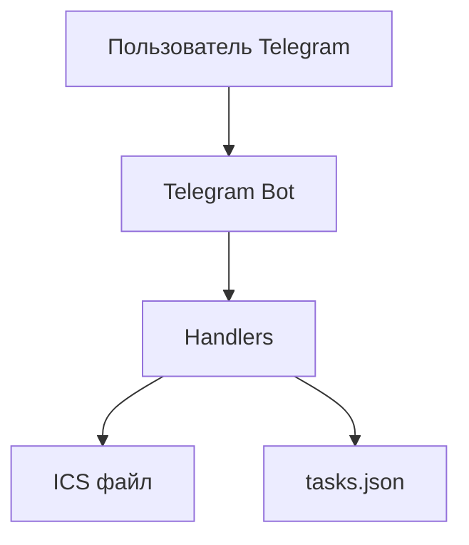
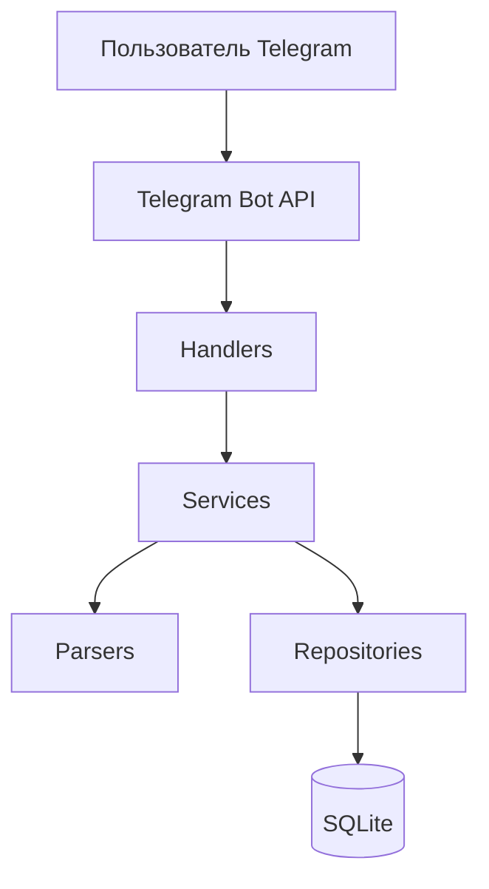

# Диаграмма компонентов

## MVP



## Улучшенная версия



## Компоненты

| Компонент | Назначение |
|---|---|
| Telegram UI | кнопки и сообщения |
| Handlers | обработка действий пользователя |
| Services | бизнес-логика |
| IcsParser | чтение `.ics` |
| Repositories | доступ к данным |
| SQLite | хранение пользователей, задач и расписания |

## Главное улучшение

Сейчас данные могут быть общими. После улучшения должно быть так:

```text
User 1 → свои задачи → своё расписание
User 2 → свои задачи → своё расписание
```
