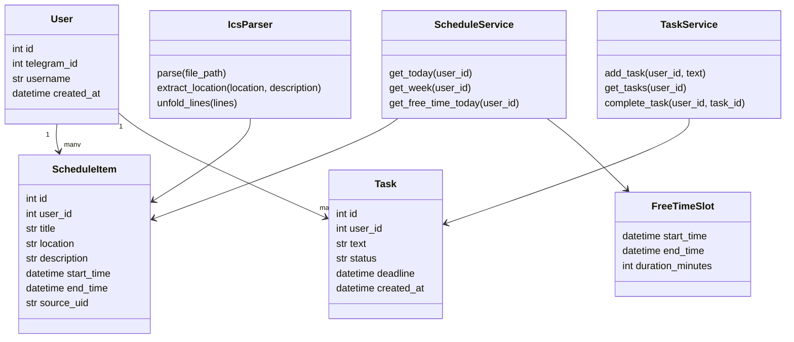

# Диаграмма классов

## Основные классы

### User

Пользователь Telegram-бота.

### ScheduleItem

Одна учебная пара. Обязательно содержит время, название и место.

### Task

Задача пользователя. В будущем может иметь статус и дедлайн.

### FreeTimeSlot

Свободный промежуток между парами.

### IcsParser

Отвечает только за парсинг `.ics`.

### ScheduleService

Отвечает за расписание: сегодня, неделя, свободное время.

### TaskService

Отвечает за добавление и просмотр задач.
