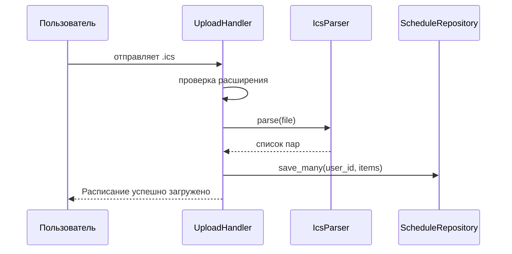
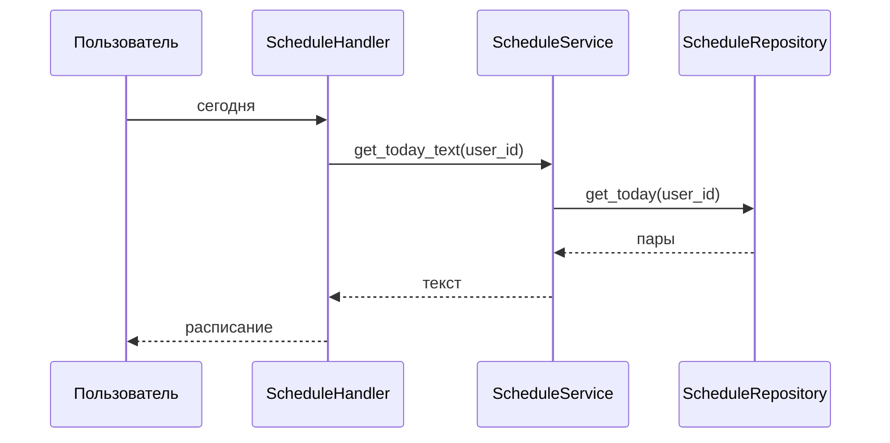
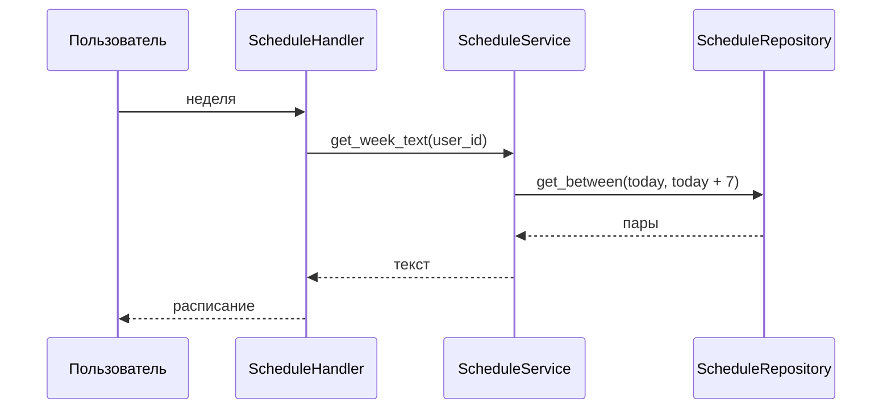
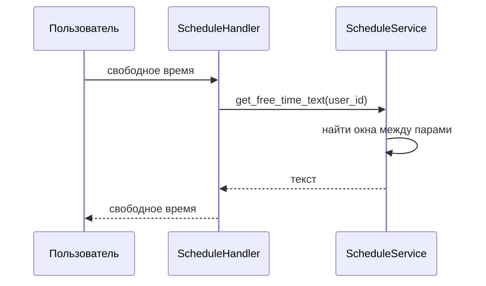
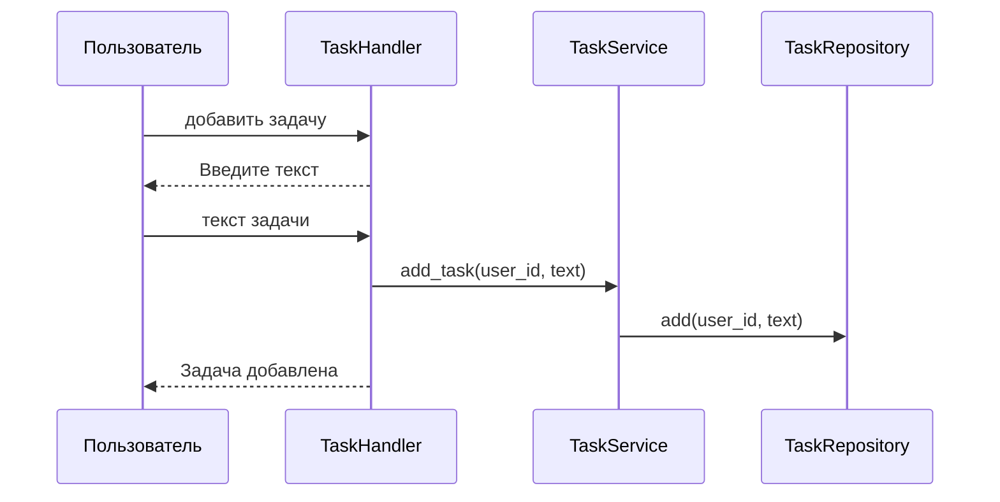

# Диаграммы последовательностей

## Импорт `.ics`

```mermaid
sequenceDiagram
    participant U as Пользователь
    participant H as UploadHandler
    participant P as IcsParser
    participant R as ScheduleRepository

    U->>H: отправляет .ics
    H->>H: проверка расширения
    H->>P: parse(file)
    P-->>H: список пар
    H->>R: save_many(user_id, items)
    H-->>U: Расписание успешно загружено
```

## Сегодня

```mermaid
sequenceDiagram
    participant U as Пользователь
    participant H as ScheduleHandler
    participant S as ScheduleService
    participant R as ScheduleRepository

    U->>H: сегодня
    H->>S: get_today_text(user_id)
    S->>R: get_today(user_id)
    R-->>S: пары
    S-->>H: текст
    H-->>U: расписание
```

## Неделя

```mermaid
sequenceDiagram
    participant U as Пользователь
    participant H as ScheduleHandler
    participant S as ScheduleService
    participant R as ScheduleRepository

    U->>H: неделя
    H->>S: get_week_text(user_id)
    S->>R: get_between(today, today + 7)
    R-->>S: пары
    S-->>H: текст
    H-->>U: расписание
```

## Свободное время

```mermaid
sequenceDiagram
    participant U as Пользователь
    participant H as ScheduleHandler
    participant S as ScheduleService

    U->>H: свободное время
    H->>S: get_free_time_text(user_id)
    S->>S: найти окна между парами
    S-->>H: текст
    H-->>U: свободное время
```

## Добавление задачи

```mermaid
sequenceDiagram
    participant U as Пользователь
    participant H as TaskHandler
    participant S as TaskService
    participant R as TaskRepository

    U->>H: добавить задачу
    H-->>U: Введите текст
    U->>H: текст задачи
    H->>S: add_task(user_id, text)
    S->>R: add(user_id, text)
    H-->>U: Задача добавлена
```
